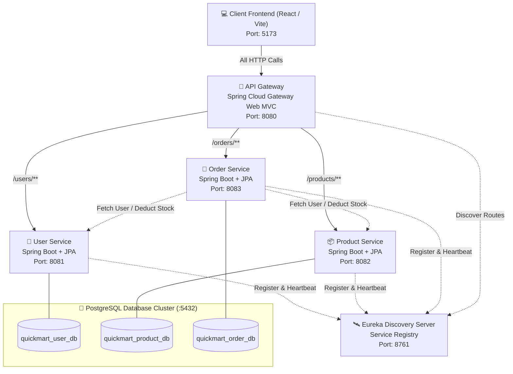

# 🛒 QuickMart — Microservices-Based E-Commerce Platform

A production-grade, distributed **E-Commerce & Retail Management System** designed and built with **Java 21, Spring Boot 4.x, Spring Cloud Netflix Eureka, Spring Cloud Gateway Server Web MVC, PostgreSQL 18, and a Modern React (Vite) Single Page Application**.

---

## 📌 Table of Contents
1. [Project Overview](#-project-overview)
2. [Architecture Diagram & Flow](#-architecture-diagram--flow)
3. [Microservices Breakdown](#-microservices-breakdown)
4. [Database Architecture (PostgreSQL)](#-database-architecture-postgresql)
5. [Frontend (React + Vite)](#-frontend-react--vite)
6. [Step-by-Step Setup & Execution](#-step-by-step-setup--execution)
7. [REST API Documentation](#-rest-api-documentation)
8. [Project Walkthrough & Presentation Guide (For Viva / Interviews)](#-project-walkthrough--presentation-guide)
9. [Common Viva / Technical Interview Q&A](#-common-viva--technical-interview-qa)

---

## 🌟 Project Overview

**QuickMart** addresses the challenges of monolithic e-commerce platforms (tight coupling, scalability bottlenecks, single point of failure) by adopting an event-ready, domain-driven **Microservices Architecture**.

- **Single Entry Point**: All client requests go through the **API Gateway** on port `8080`.
- **Dynamic Service Discovery**: Services discover each other dynamically via **Netflix Eureka** on port `8761`.
- **Database per Service**: Independent PostgreSQL relational databases for isolated data integrity.
- **Inter-Service Communication**: `Order Service` aggregates user and product data dynamically via Eureka load-balanced HTTP clients.
- **Modern Interactive UI**: High-end React SPA with real-time stock management, cart checkout, admin studio, and distributed architecture health monitoring.

---

## 🏗️ Architecture Diagram & Flow



---

## 📦 Microservices Breakdown

| Service | Port | Technology | Database | Key Responsibilities |
|---|:---:|---|---|---|
| **`eureka-server`** | `8761` | Spring Cloud Netflix Eureka | — | Service registry where all microservices register instances and send 30s heartbeats. |
| **`api-gateway`** | `8080` | Spring Cloud Gateway Server Web MVC | — | Single public gateway, reverse proxy, route routing, and Global CORS management. |
| **`user-service`** | `8081` | Spring Boot, Spring Data JPA | `quickmart_user_db` | User registration, authentication, role access (`CUSTOMER`, `ADMIN`), and profiles. |
| **`product-service`** | `8082` | Spring Boot, Spring Data JPA | `quickmart_product_db` | Product catalog, category filtering, keyword search, inventory tracking, and stock reduction. |
| **`order-service`** | `8083` | Spring Boot, Spring Data JPA | `quickmart_order_db` | Cart checkout, total calculation + tax, inter-service verification with User & Product services, and status management. |
| **`frontend`** | `5173` | React 19, Vite, Lucide Icons | LocalStorage + API | Modern storefront, sliding cart drawer, order tracking, admin management, and live system ping. |

---

## 🐘 Database Architecture (PostgreSQL)

Each microservice manages its own isolated PostgreSQL database:

```sql
-- 1. quickmart_user_db
CREATE TABLE users (
    id BIGSERIAL PRIMARY KEY,
    name VARCHAR(255) NOT NULL,
    email VARCHAR(255) UNIQUE NOT NULL,
    password VARCHAR(255) NOT NULL,
    role VARCHAR(50) NOT NULL,
    phone VARCHAR(50),
    address VARCHAR(255),
    created_at TIMESTAMP DEFAULT CURRENT_TIMESTAMP
);

-- 2. quickmart_product_db
CREATE TABLE products (
    id BIGSERIAL PRIMARY KEY,
    name VARCHAR(255) NOT NULL,
    description VARCHAR(1000),
    price DOUBLE PRECISION NOT NULL,
    category VARCHAR(100) NOT NULL,
    stock_quantity INT DEFAULT 0,
    image_url VARCHAR(1000),
    rating DOUBLE PRECISION DEFAULT 4.5,
    created_at TIMESTAMP DEFAULT CURRENT_TIMESTAMP
);

-- 3. quickmart_order_db
CREATE TABLE orders (
    id BIGSERIAL PRIMARY KEY,
    order_number VARCHAR(100) UNIQUE NOT NULL,
    user_id BIGINT NOT NULL,
    user_name VARCHAR(255),
    user_email VARCHAR(255),
    total_amount DOUBLE PRECISION NOT NULL,
    status VARCHAR(50) NOT NULL,
    shipping_address VARCHAR(255),
    payment_method VARCHAR(50),
    created_at TIMESTAMP DEFAULT CURRENT_TIMESTAMP
);

CREATE TABLE order_items (
    id BIGSERIAL PRIMARY KEY,
    order_id BIGINT REFERENCES orders(id) ON DELETE CASCADE,
    product_id BIGINT NOT NULL,
    product_name VARCHAR(255) NOT NULL,
    unit_price DOUBLE PRECISION NOT NULL,
    quantity INT NOT NULL,
    subtotal DOUBLE PRECISION NOT NULL
);
```

---

## 💻 Frontend (React + Vite)

The frontend is located in the [`frontend/`](file:///e:/Cdac_final/microservices/microservices-project/frontend) folder:
- **Storefront View**: Category filter tabs, search bar, sort options, live stock status badge, and one-click add-to-cart.
- **Cart Drawer**: Real-time quantity adjustment, subtotal + 5% tax calculation, address input, and payment selector.
- **My Orders**: Real-time order timeline with order status pills (`CONFIRMED`, `SHIPPED`, `DELIVERED`).
- **Admin Studio**:
  - Products Catalog: Add, Edit, and Delete products in PostgreSQL.
  - Users Manager: Inspect registered users.
  - Orders Pipeline: Change order status.
- **Architecture Explorer**: Live ping button to test health and connectivity of all 5 backend components.

---

## 🚀 Step-by-Step Setup & Execution

### Step 1: Start PostgreSQL
Ensure PostgreSQL is running locally on port `5432` with username `postgres` and password `12345`.
*(The 3 databases `quickmart_user_db`, `quickmart_product_db`, and `quickmart_order_db` will be initialized automatically).*

### Step 2: Start Microservices (In Order)

Open separate terminal windows and run:

```powershell
# Terminal 1: Eureka Discovery Server (Port 8761)
cd eureka-server
mvn spring-boot:run

# Terminal 2: API Gateway (Port 8080)
cd api-gateway
mvn spring-boot:run

# Terminal 3: User Service (Port 8081)
cd user-service
mvn spring-boot:run

# Terminal 4: Product Service (Port 8082)
cd product-service
mvn spring-boot:run

# Terminal 5: Order Service (Port 8083)
cd order-service
mvn spring-boot:run
```

### Step 3: Start the React Frontend
```powershell
cd frontend
npm run dev
```
Open **`http://localhost:5173`** in your browser!

---

## 📡 REST API Documentation

### 👤 User Service (`/users`)
| Method | Endpoint | Description |
|:---:|:---|:---|
| `GET` | `/users` | List all registered users |
| `GET` | `/users/{id}` | Get user details by ID |
| `POST` | `/users/register` | Register a new user |
| `POST` | `/users/login` | Authenticate user credentials |
| `PUT` | `/users/{id}` | Update profile information |
| `DELETE` | `/users/{id}` | Remove user |

### 📦 Product Service (`/products`)
| Method | Endpoint | Description |
|:---:|:---|:---|
| `GET` | `/products` | Get products (supports `?category=...&search=...`) |
| `GET` | `/products/{id}` | Get product details |
| `GET` | `/products/categories` | Get distinct categories list |
| `POST` | `/products` | Create a new product (Admin) |
| `PUT` | `/products/{id}` | Update product details (Admin) |
| `DELETE` | `/products/{id}` | Delete product (Admin) |
| `POST` | `/products/{id}/reduce-stock?quantity=X` | Decrement inventory on order |

### 🛒 Order Service (`/orders`)
| Method | Endpoint | Description |
|:---:|:---|:---|
| `POST` | `/orders` | Place order (calls User & Product service via Eureka) |
| `GET` | `/orders` | Get all system orders (Admin) |
| `GET` | `/orders/user/{userId}` | Get orders for active customer profile |
| `GET` | `/orders/{id}` | Get order details with items |
| `PUT` | `/orders/{id}/status` | Update order delivery status |

---

